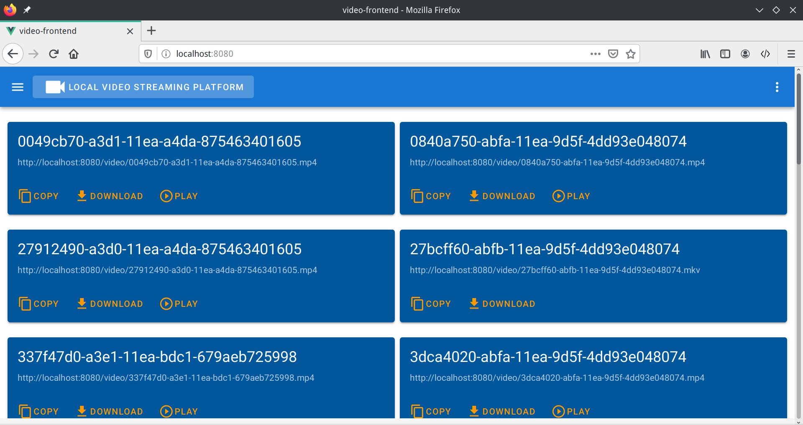
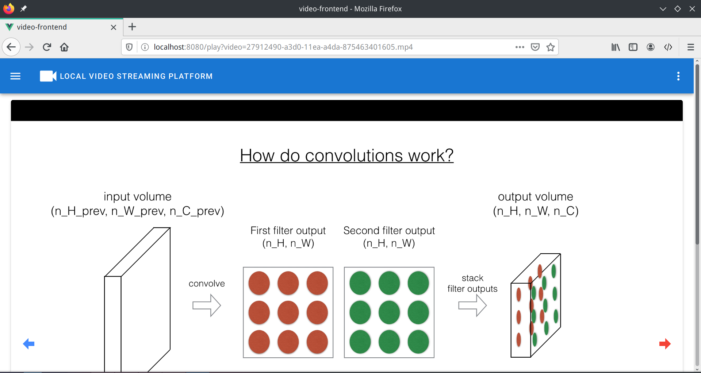

# vuedeo
Local video streaming platform

`vuedeo` is a local video streaming platform developed with `Go` and `Vue`. Serving a video directory with `vuedeo`, you can watch videos anywhere in your house, on mobile, notebook, pad and so on.

## Features

+ Cross paltform: Windows, Linux, macOS
+ All you need is an executable binary, no dependency
+ Automatic switch to night mode

## Usage

+ Download binary at [Releases page](https://github.com/greenhandatsjtu/vuedeo/releases)

+ Add the executable to the PATH

+ Serve a video directory. For example, on Linux,  enter `vudeo` and you can access to the streaming service by visiting `http://ip:8080`. Also, you can specify working directory and port.

+ `CLI` usage:

  ```
  Usage of ./vuedeo_linux:
    -P string
          Specify working dir. (default "{current directory}")
    -h    Show help.
    -p int
          Specify port. (default 8080)
  ```

## Screenshots

home:



video page:



